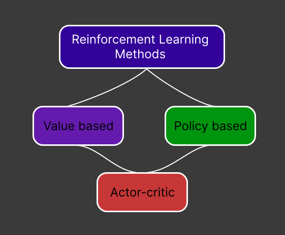
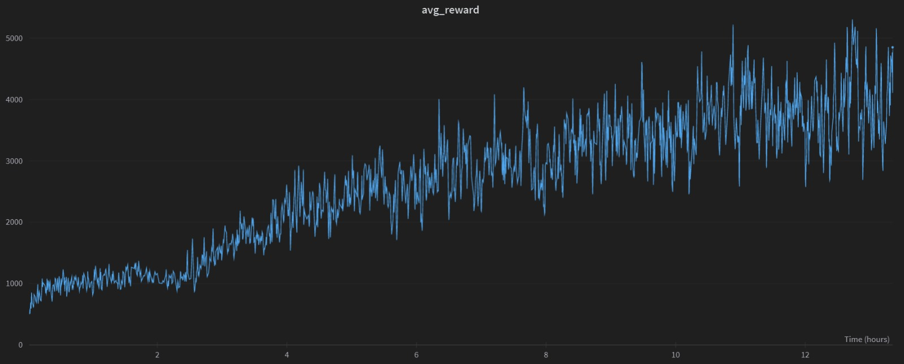
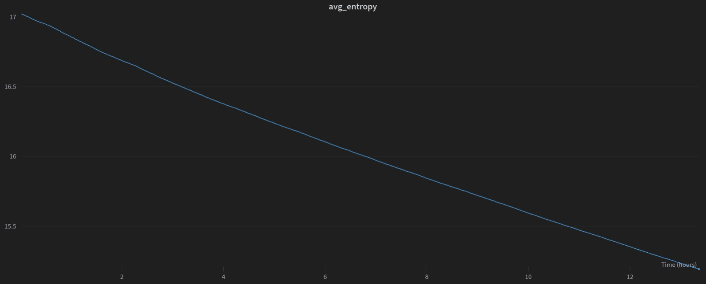
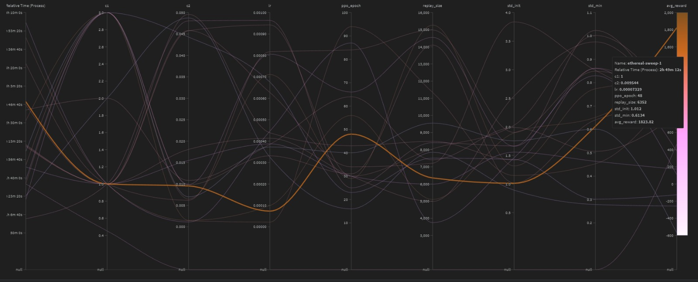
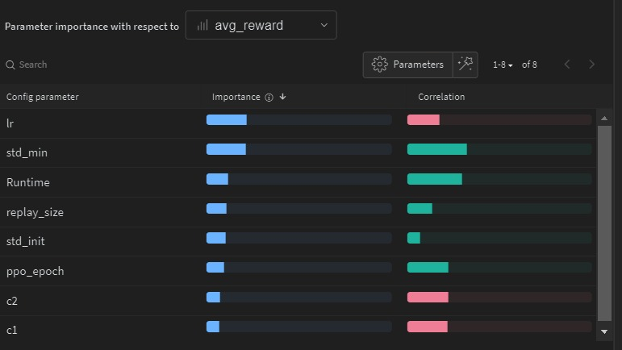

# Deep RL With MuJoCo

Final project for the 2023-winter's edition of the *Artificial Intelligence with Deep Learning* postgraduate course taught by the Universitat Politècnica de Catalunya (UPC).

The goal of this project is to train several AI models to perform tasks using (Deep) Reinforcement Learning in the MuJoCo physics simulator.

### Team Members

* Adrià De Angulo
* Daniel Matas
* Hariss Farhan
* Miquel Quesada

### Project Advisor

* JuanJo Nieto

## Index

1. [How To Run](#how-to-run)
2. [Introduction To Reinforcement Learning](#intro-to-rl)
3. [Proximal Policy Optimization (PPO)](#ppo)
4. [MuJoCo](#mujoco)
    1. [Half Cheetah](#halfcheetah)
        1. [Overview](#overview1)
        2. [Hypothesis](#hypothesis1)
        3. [Experiment Setup](#exp-setup1)
            1. [Architecture](#architecture1)
            2. [Hyperparameters](#hyperparameters1)
        4. [Results](#results1)
        5. [Conclusions](#conclusions1)
    2. [ANYmal C](#anymal-c)
        1. [Overview](#overview2)
        2. [Hypothesis](#hypothesis2)
        3. [Experiment Setup](#exp-setup2)
            1. [Architecture](#architecture2)
            2. [Hyperparameters](#hyperparameters2)
        4. [Results](#results2)
        5. [Conclusions](#conclusions2)
5. [Future Work](#future-work)
6. [Computational Resources](#comp-res)
7. [Glossary: Hyperparameters](#glossary)

## How To Run 

In order to speed up the trainings of our models we have separated the video capture part of the code from the actual training code.

The easiest way to run the project is via Google Colab. Here you will find direct links to the notebooks. Open them and execute the cells.

Alternatively we have also included a folder with the python files in case you want to download the code and use it in your machine. Note that prior adaptation of the code to your machine might be needed beforehand.

* Half Cheetah (Train/Sweep)

    

* Half Cheetah (Video Capture)

    

* ANYmal C (Train/Sweep)

    

* ANYmal C (Video Capture)

    

## Introduction To Reinforcement Learning 

Reinforcement Learning is an area of Machine Learning concerned with how intelligent agents ought to take actions in an environment based on rewarding desired behaviors and/or punishing undesired ones. 
 
> "Reinforcement learning is learning what to do—how to map situations to actions—so
as to maximize a numerical reward signal. The learner is not told which actions to
take, but instead must discover which actions yield the most reward by trying them. In the most interesting and challenging cases, actions may affect not only the immediate reward but also the next situation and, through that, all subsequent rewards. These two characteristics—trial-and-error search and delayed reward—are the two most important distinguishing features of reinforcement learning." — Richard S. Sutton and Andrew G. Barto [^1]

[^1]: [Reinforcement Learning: An Introduction](http://incompleteideas.net/book/the-book-2nd.html)

In Reinforcement Learning, there are many methods that can be classified into 
two main groups: policy-based methods and value-based methods. 

    

On one hand, a policy-based method is a type of reinforcement learning algorithm that learns a policy directly without explicitly computing the value function. In this approach, the agent directly learns a policy that maps the state to actions.

The policy is typically represented as a probability distribution over actions, and the agent tries to maximize the expected cumulative reward over time by adjusting its policy based on feedback from the environment.

Policy-based methods can be classified into two main categories: deterministic policy gradient (DPG) methods and stochastic policy gradient (SPG) methods.

A value-based method is an algorithm that learns to estimate the value function of states or state-action pairs. The value function represents the expected cumulative reward an agent can obtain from a particular state or state-action pair over time.

In value-based methods, the agent uses this value function to choose the action that maximizes its expected cumulative reward. The value function can be learned using various techniques, such as Monte Carlo methods, temporal difference learning, or Q-learning.

## PPO 

Proximal Policy Optimization (PPO) is considered on of the state-of-the-art algorithms in Reinforcement Learning, and it consists of a policy gradient method whose main goal is to have an algorithm that is as reliable as possible, and is data efficient. 

PPO is a policy-based reinforcement learning algorithm. It directly learns a policy that maps states to actions, rather than estimating a value function like value-based methods such as Q-learning.

In particular, PPO optimizes the policy by maximizing a surrogate objective function that directly estimates the policy's expected performance. This surrogate objective function is optimized using stochastic gradient descent, with the policy being updated to maximize this objective while also satisfying a trust region constraint to ensure the policy update is not too large.

As a policy-based algorithm, PPO is well-suited for tasks with continuous action spaces, and can handle stochastic policies, which can be important in environments with complex dynamics or multiple optimal actions.

Given the complexity of our model, which involves multiple joints and actions, we decided to utilize this algorithm for our project.

## MuJoCo 

 [MuJoCo](https://mujoco.org/) (which stands for Multi-Joint dynamics with Contact) is a general purpose physics engine that aims to facilitate research and development in robotics, biomechanics, graphics and animation, machine learning, and other areas that demand fast and accurate simulation of articulated structures interacting with their environment.

Initially developed by Roboti LLC, it was acquired and made freely available by [DeepMind](https://www.deepmind.com/) in October 2021, and open sourced in May 2022.

    

## Half Cheetah 

### Overview 

Half Cheetah is an [OpenAI](https://openai.com/)'s [Gym](https://www.gymlibrary.dev/) environment created to be used in MuJoCo.
The Half Cheetah is a 2-dimensional robot consisting of 9 links and 8 joints connecting them (including two paws). The goal is to apply a torque on the joints to make the cheetah run forward (right) as fast as possible, with a positive reward allocated based on the distance moved forward and a negative reward allocated for moving backward. The torso and head of the cheetah are fixed, and the torque can only be applied on the other 6 joints over the front and back thighs (connecting to the torso), shins (connecting to the thighs) and feet (connecting to the shins).

    

### Hypothesis 

### Experiment setup 

#### Architecture 

We based the architecture from the lunar lander lab.

Lunar lander es discreto
Half cheetah es un entorno continuo

Tenemos 6 acciones que van de -1 a 1

    self.mlp = nn.Sequential(
        nn.Linear(obs_len, 64),
        nn.Tanh(),
        nn.Linear(64, 128),
        nn.Tanh())

    self.actor = nn.Linear(128, act_len)

    self.critic = nn.Linear(128, 1)

The architecture consists of three neural networks: an MLP (multi-layer perceptron), an actor network, and a critic network. Here is a breakdown of each component:

The multi-layer perceptron consists of two fully connected layers. The first one of 64 neurons and the second one with 128. Both of them followed by an hyperbolic tangent activation function.

The output of the multilayer perceptron is passed as input to both the actor and the critic networks.

The actor, is responsible for producing the policy distribution over actions, whereas the critic is responsible for estimating the state value function, which is the expected return starting from the current state.

As you can see, the architecture follows a common pattern in reinforcement learning called the actor-critic method. The actor network generates a policy distribution over actions, while the critic network estimates the value of each state or state-action pair. The actor uses the critic's estimates to improve the policy, while the critic learns to predict the expected returns accurately.

#### Hyperparameters 

We performed several sweeps in order to find the best values for some of the hyperparameters, and we found out that the hp that had more influence were the learning rate, c1 and c2, ppo_epoch, runtime and the replay size.

After the following sweep we found a good set of hyperparameters, and after some trials we ended up using the following hyper

    hparams = {
        'gamma' : 0.99,
        'log_interval' : 10,
        'num_episodes': 50000,
        'lr' : 1e-4,
        'clip_param': 0.1,
        'ppo_epoch': 45,
        'replay_size': 600,
        'batch_size': 128,
        'c1': 3.,
        'c2': 0.01,
        'std_init': 1.0,
        'video_interval': 200
    }

### Results 

       

### Conclusions 

## Anybotics ANYmal C 

### Overview 

The ANYmal C is a quadruped robot used for inspection of industrial facilities. With it's 8 joints it is able to navigate through complex environments, such as industrial inspection, search and rescue, and scientific research. It is highly adaptable and can be customized to suit a wide range of tasks and environments, making it a versatile platform for robotics research and development. 

The Anybiotics ANYmal C model has 12 degrees of freedom, enabling it to execute a wide variety of dynamic movements, such as walking, trotting, running, climbing, and crawling. These degrees of freedom provide the robot with the ability to move its body in many different ways, making it highly versatile and adaptable.

    

<em>[Anybotics ANYmal C](https://www.anybotics.com/anymal-autonomous-legged-robot/)</em>

### Hypothesis 

We hypothesize that, by using the PPO algorithm with reinforcement learning to train the Anybotics model, we can achieve a higher reward compared to baseline models trained with other reinforcement learning algorithms. 
  
  
Also, we predict that by performing a hyperparameter sweep and optimizing the hyperparameters, we can further improve the performance of the model and achieve a higher reward. We expect that the hyperparameters such as the learning rate, discount factor, and batch size will have the most significant impact on the performance of the model, and tuning them appropriately will lead to a better-performing model. Additionally, we anticipate that by increasing the number of training episodes and using a larger replay buffer, we can help stabilize the training process and prevent the model from overfitting to recent experiences.
 
 
 Overall, we believe that by combining the PPO algorithm with reinforcement learning and optimizing the hyperparameters, we can develop a more efficient and robust Anybotics model that can achieve a higher reward in a variety of simulated environments.
  
  

### Experiment setup 

The steps we followed in order to do this experiment, were: 
 
1. Setting up the MuJoCo environment, and importing all the necessary libraries:
 
    Install MuJoCo and set up the environment variables
    Download the appropriate robot model and environment file.
    Finally, import necessary libraries such as matplotlib, wandb, etc. 

2. Hyperparameters tuning with a sweep:
 
Define the range of values for each hyperparameter (e.g. learning rate, batch size, etc.).
Perform the hyperparameter sweep using grid search or random search.
Record the results for each set of hyperparameters (e.g. reward, entropy, training time, etc.)

3. Training the final model with the previous parameters with a long run to obtain rewards and entropy metrics:
 
Select the set of hyperparameters that yielded the best results from the hyperparameter sweep
Write a script to train the final model using the selected hyperparameters and a long training run.
Monitor the training progress by logging the reward and entropy metrics at regular intervals in Wandb and, also, visualize the results using graphs or plots to better understand the learning process

4. Evaluation:
 
    Test the trained model on a set of unseen environments to evaluate its performance.

Overall, this experimental setup provides a systematic approach for designing and evaluating reinforcement learning models using the MuJoCo environment, hyperparameter tuning, and long training runs.

#### Architecture 

We have added one hidden layer more than in the half cheetah environment and we use more input parameters.

    self.mlp = nn.Sequential(
        nn.Linear(obs_len, 128),
        nn.Tanh(),
        nn.Linear(128, 128),
        nn.Tanh())

    self.actor = nn.Sequential(
        nn.Linear(128,64),
        nn.Tanh(),
        nn.Linear(64,act_len))

    self.critic = nn.Sequential(
        nn.Linear(128,64),
        nn.Tanh(),
        nn.Linear(64,1))

The architecture consists of three neural networks: an MLP (multi-layer perceptron), an actor network, and a critic network. Here is a breakdown of each component:

The  multi-layer perceptron  consists of two fully connected layers with 128 neurons each, followed by a hyperbolic tangent activation function.

The output of the multilayer perceptron is passed as input to both the actor and the critic networks.

The actor, is responsible for producing the policy distribution over actions, whereas the critic  is responsible for estimating the state value function, which is the expected return starting from the current state. 

As you can see, the architecture follows a common pattern in reinforcement learning called the actor-critic method. The actor network generates a policy distribution over actions, while the critic network estimates the value of each state or state-action pair. The actor uses the critic's estimates to improve the policy, while the critic learns to predict the expected returns accurately.

#### Hyperparameters 
    hparams = {
        'gamma' : 0.99,
        'log_interval' : 50,
        'num_episodes': 15000,
        'lr' : 1e-5,
        'clip_param': 0.1,
        'ppo_epoch': 48,
        'replay_size': 6400,
        'batch_size': 128,
        'c1': 1.,
        'c2': 0.001,
        'std_init': 1.0,
        'std_min': 0.6,
        }
After performing the sweep, these were the hyperparameters that gave us the best reward for the experiment. On this hyperparameters, we find the following: 

1. gamma: discount factor for future rewards. A higher value indicates that future rewards are given more weight in the decision-making process.

2. log_interval: the number of training episodes between each logging statement. This determines how often to log information about the training progress, such as the reward or loss.

3. num_episodes: the total number of training episodes to run.

4. lr: the learning rate for the optimizer. This determines how much to update the model's weights based on the error of each prediction.

5. clip_param: the clipping parameter for the Proximal Policy Optimization (PPO) algorithm. This determines the maximum amount that the new policy can deviate from the old policy during each update.

6. ppo_epoch: the number of times to iterate over the entire training dataset during each PPO update. A higher value may improve convergence at the cost of increased computation.

7. replay_size: the maximum size of the replay buffer, which stores past observations and actions. A larger replay buffer can help stabilize training by preventing the model from overfitting to recent experiences.

8. batch_size: the number of samples to use for each mini-batch during training.

9. c1: the coefficient for the value loss term in the PPO loss function. A higher value indicates that the value loss term is given more weight in the overall loss.

10. c2: the coefficient for the entropy term in the PPO loss function. A higher value indicates that the entropy term is given more weight in the overall loss.

11. std_init: the initial standard deviation for the Gaussian policy.

12. std_min: the minimum standard deviation for the Gaussian policy. This determines the minimum amount of exploration the agent will perform. 

### Results 

 

### Conclusions 

Based on the given information, we draw a series of conclusions:

1. The training algorithm being used is Proximal Policy Optimization (PPO), which is a reinforcement learning algorithm that has been shown to be effective for training robotic control tasks.

2. The algorithm improved the model's walking performance over time, as evidenced by the videos, with a maximum reward of 5925.51 achieved during training.

3. The entropy started at 17.025 and went down to 14.564 in 20.3 hours, which suggests that the policy became more deterministic as the training progressed.

## Future Work 

* Keep on working with hyper parameter tuning.

* Training Multiple Actors and parallelizing with GPU.

* Add more data to the state: last actions taken, collisions, terrain, etc.

* Reward design: penalizing energy consumption to optimize movements and make them smoother.

* Change the entropy non-linearly or take the value for the covariance matrix from a NN.

* Test with a bigger neural network.

## Computational Resources 

As the neural networks that we used were pretty small, we didn't find ourselves in the need of using GPUs for the training of our models (we would have spent more time passing the parameters to the GPU than doing the actual calculations in the CPU). 

To add on that, MuJoCo runs only on CPU and has no GPU support currently, so the only use case for GPUs in our project has been the render and capture of the videos.

Given this situation, for the development of this project, we have mainly used Google Colab, and when we needed to do longer trainings, two laptops with better specs to speed up the process a little bit (and also don't get kicked out from the runtime).

Here are the specifications of the machines:

* Google Colab
    * Intel Xeon @ 2.20GHz
    * 12GB RAM
    * NVIDIA Tesla K80 12GB GDDR5

* Laptop #1
    * AMD Ryzen 7 5800H @ 3.20GHz
    * 16GB RAM
    * NVIDIA GeForce RTX 3070 8GB GDDR6

* Laptop #2
    * INTEL Core i7-9750H @ 2.60 GHz
    * 8GB RAM
    * NVIDIA GeForce GTX 1050 4GB GDDR5

## Glossary: Hyperparameters 

In the following list we explain the different hyperparameters:

1. gamma: discount factor for future rewards. A higher value indicates that future rewards are given more weight in the decision-making process.

2. log_interval: the number of training episodes between each logging statement. This determines how often to log information about the training progress, such as the reward or loss.

3. num_episodes: the total number of training episodes to run.

4. lr: the learning rate for the optimizer. This determines how much to update the model's weights based on the error of each prediction.

5. clip_param: the clipping parameter for the Proximal Policy Optimization (PPO) algorithm. This determines the maximum amount that the new policy can deviate from the old policy during each update.

6. ppo_epoch: the number of times to iterate over the entire training dataset during each PPO update. A higher value may improve convergence at the cost of increased computation.

7. replay_size: the maximum size of the replay buffer, which stores past observations and actions. A larger replay buffer can help stabilize training by preventing the model from overfitting to recent experiences.

8. batch_size: the number of samples to use for each mini-batch during training.

9. c1: the coefficient for the value loss term in the PPO loss function. A higher value indicates that the value loss term is given more weight in the overall loss.

10. c2: the coefficient for the entropy term in the PPO loss function. A higher value indicates that the entropy term is given more weight in the overall loss.

11. std_init: the initial standard deviation for the Gaussian policy.

12. std_min: the minimum standard deviation for the Gaussian policy. This determines the minimum amount of exploration the agent will perform. 