# Deep RL With MuJoCo

Final project for the 2023-winter's edition of the *Artificial Intelligence with Deep Learning* postgraduate course taught by the Universitat Politècnica de Catalunya (UPC).

The goal of this project is to train several AI models to perform tasks using (Deep) Reinforcement Learning in the MuJoCo physics simulator.

### Team Members

* Adrià De Angulo
* Daniel Matas
* Hariss Mohammad Jabeen
* Miquel Quesada

### Project Advisor

* JuanJo Nieto

 

## Index

1. [How To Run](#how-to-run)
2. [Intro To Reinforcement Learning](#intro-to-rl)
3. [Proximal Policy Optimization (PPO)](#ppo)
4. [MuJoCo](#mujoco)
    1. [Half Cheetah](#halfcheetah)
        1. [Overview](#overview1)
        2. [Hypothesis](#hypothesis1)
        3. [Experiment Setup](#exp-setup1)
            1. [Architecture](#architecture1)
            2. [Hyperparameters](#hyperparameters1)
        4. [Results](#results1)
        5. [Conclusions](#conclusions1)
    2. [ANYmal C](#anymal-c)
        1. [Overview](#overview2)
        2. [Hypothesis](#hypothesis2)
        3. [Experiment Setup](#exp-setup2)
            1. [Architecture](#architecture2)
            2. [Hyperparameters](#hyperparameters2)
        4. [Results](#results2)
        5. [Conclusions](#conclusions2)
    3. [ANYmal C + Step](#anymal-c-step)
        1. [Overview](#overview3)
        2. [Hypothesis](#hypothesis3)
        3. [Experiment Setup](#exp-setup3)
            1. [Architecture](#architecture3)
            2. [Hyperparameters](#hyperparameters3)
        4. [Results](#results3)
        5. [Conclusions](#conclusions3)
5. [Future Work](#future-work)
6. [Computational Resources](#comp-res)
7. [Glossary: Hyperparameters](#glossary)
8. [References](#ref)

 

## How To Run 

In order to speed up the trainings of our models we have separated the hyper parameters sweep, the traing and the video capture part of the code from the actual training code.

The easiest way to run the project from every setup you may have is via Google Colab. Here you will find direct links to the notebooks. Open them and execute the cells.

* Half Cheetah (Train/Sweep)

    

* Half Cheetah (Video Capture)

    

* ANYmal C (Train/Sweep)

    

* ANYmal C (Video Capture)

    

Alternatively we have also included a folder with the python files in case you want to download the code and use it in your machine. Note that prior adaptation of the code to your machine might be needed beforehand.

 

## Intro To Reinforcement Learning 

Reinforcement Learning is an area of Machine Learning concerned with how intelligent agents ought to take actions in an environment based on rewarding desired behaviors and/or punishing undesired ones. 
 
> "Reinforcement learning is learning what to do—how to map situations to actions—so
as to maximize a numerical reward signal. The learner is not told which actions to
take, but instead must discover which actions yield the most reward by trying them. In the most interesting and challenging cases, actions may affect not only the immediate reward but also the next situation and, through that, all subsequent rewards. These two characteristics—trial-and-error search and delayed reward—are the two most important distinguishing features of reinforcement learning." — *Reinforcement Learning: An Introduction,* Richard S. Sutton & Andrew G. Barto

In Reinforcement Learning, there are many methods that can be classified into 
two main groups: policy-based methods and value-based methods. 

    

On one hand, a policy-based method is a type of reinforcement learning algorithm that learns a policy directly without explicitly computing the value function. In this approach, the agent directly learns a policy that maps the state to actions.

The policy is typically represented as a probability distribution over actions, and the agent tries to maximize the expected cumulative reward over time by adjusting its policy based on feedback from the environment.

Policy-based methods can be classified into two main categories: deterministic policy gradient (DPG) methods and stochastic policy gradient (SPG) methods.

A value-based method is an algorithm that learns to estimate the value function of states or state-action pairs. The value function represents the expected cumulative reward an agent can obtain from a particular state or state-action pair over time.

In value-based methods, the agent uses this value function to choose the action that maximizes its expected cumulative reward. The value function can be learned using various techniques, such as Monte Carlo methods, temporal difference learning, or Q-learning.

 

## Proximal Policy Optimization (PPO) 

Proximal Policy Optimization (PPO) is considered one of the state-of-the-art algorithms in Reinforcement Learning, and it consists of a policy gradient method whose main goal is to have an algorithm that is as reliable as possible, and is data efficient. 

PPO is a policy-based reinforcement learning algorithm. It directly learns a policy that maps states to actions, rather than estimating a value function like value-based methods such as Q-learning.

In particular, PPO optimizes the policy by maximizing a surrogate objective function that directly estimates the policy's expected performance. This surrogate objective function is optimized using stochastic gradient descent, with the policy being updated to maximize this objective while also satisfying a trust region constraint to ensure the policy update is not too large.

As a policy-based algorithm, PPO is well-suited for tasks with continuous action spaces, and can handle stochastic policies, which can be important in environments with complex dynamics or multiple optimal actions.

Given the complexity of our model, which involves multiple joints and actions, we decided to utilize this algorithm for our project.

 

## MuJoCo 

 [MuJoCo](https://mujoco.org/) (which stands for Multi-Joint dynamics with Contact) is a general purpose physics engine that aims to facilitate research and development in robotics, biomechanics, graphics and animation, machine learning, and other areas that demand fast and accurate simulation of articulated structures interacting with their environment.

Initially developed by Roboti LLC, it was acquired and made freely available by [DeepMind](https://www.deepmind.com/) in October 2021, and open sourced in May 2022.

    

 

## Half Cheetah 

### Overview 

Half Cheetah is an [OpenAI](https://openai.com/)'s [Gym](https://www.gymlibrary.dev/) environment created to be used in MuJoCo.
The Half Cheetah is a 2-dimensional robot consisting of 9 links and 8 joints connecting them (including two paws). The goal is to apply a torque on the joints to make the cheetah run forward (right) as fast as possible, with a positive reward allocated based on velocity at the x axis. The torso and head of the cheetah are fixed, and the torque can only be applied on the other 6 joints over the front and back thighs (connecting to the torso), shins (connecting to the thighs) and feet (connecting to the shins).

    

### Hypothesis 

We hypothesize that, by using the PPO algorithm we will be able to solve the experiment on the environment with a small neural network. After that, we will use the same code as a template for the next experiments that we want to do. The general idea is to make the Half-cheetah walk/run forward as fast as it can.
  
  
Also, we predict that by performing a hyperparameter sweep and optimizing the hyperparameters, we can further improve the performance of the model and achieve a higher reward. We expect that the hyperparameters such as the learning rate and discount factor will have the most significant impact on the performance of the model, and tuning them appropriately will lead to a better-performing model. Additionally, we anticipate that by increasing the number of training episodes and using a larger replay buffer, we can help stabilize the training process and prevent the model from overfitting to recent experiences.
 
 
 Overall, we believe that by using the PPO algorithm and optimizing the hyperparameters, we can develop an efficient and robust model that can achieve a high reward in a the simulated environment.

### Experiment Setup 

The steps we followed in order to do this experiment, were: 
 

1. Setting up the MuJoCo environment, and importing all the necessary libraries:  
Install MuJoCo and set up the environment variables.  
Download the appropriate robot model and environment file.  
Finally, import necessary libraries such as torch, numpy, wandb, etc. 

2. Hyperparameters tuning with a sweep:  
Define the range of values for each hyperparameter (e.g. learning rate, PPO epochs, etc.).  
Perform the hyperparameter sweep using bayes method.  
Record the results for each set of hyperparameters (e.g. reward, entropy, training time, etc.)

3. Training the final model with the previous parameters with a long run to obtain rewards and entropy metrics:  
Select the set of hyperparameters that yielded the best results from the hyperparameter sweep.  
Monitor the training progress by logging the reward and entropy metrics at regular intervals in Wandb and, also, visualize the results using graphs or plots to better understand the learning process.

4. Evaluation:  
Test the trained model on the environment to evaluate its performance and record a video of the test.

Overall, this experiment setup provides a systematic approach for designing and evaluating reinforcement learning models using the gym environment with Mujoco engine, hyperparameter tuning, and long training runs.

#### Architecture 

    self.mlp = nn.Sequential(
        nn.Linear(obs_len, 64),
        nn.Tanh(),
        nn.Linear(64, 128),
        nn.Tanh())

    self.actor = nn.Linear(128, act_len)

    self.critic = nn.Linear(128, 1)

The architecture consists of three neural networks: an MLP (multi-layer perceptron), an actor network, and a critic network. Here is a breakdown of each component:

The multi-layer perceptron consists of two fully connected layers. The first one of 64 neurons and the second one with 128. Both of them followed by an hyperbolic tangent activation function.

The output of the multilayer perceptron is passed as input to both the actor and the critic networks.

The actor, is responsible for producing the policy distribution over actions, whereas the critic is responsible for estimating the state value function, which is the expected return starting from the current state.

As you can see, the architecture follows a common pattern in reinforcement learning called the actor-critic method. The actor network generates a policy distribution over actions, while the critic network estimates the value of each state or state-action pair. The actor uses the critic's estimates to improve the policy, while the critic learns to predict the expected returns accurately.

#### Hyperparameters 

> See the [hyperparameter glossary](#glossary) for an explanation of each hyperparameter

We performed several sweeps in order to find the best values for some of the hyperparameters, and we found out that the ones that had more influence were the learning rate, c1 and c2, ppo_epoch, runtime and the replay size.

After the following sweep we found a good set of hyperparameters, and after some trials we ended up using the following:

    hparams = {
        'gamma' : 0.99,
        'log_interval' : 10,
        'num_episodes': 50000,
        'lr' : 1e-4,
        'clip_param': 0.1,
        'ppo_epoch': 45,
        'replay_size': 600,
        'batch_size': 128,
        'c1': 3.,
        'c2': 0.01,
        'std_init': 1.0,
        'video_interval': 200
        }

### Results 

        

 

### Conclusions 

Based on the given information, we draw a series of conclusions:

1. The training algorithm used was succesful in completing the given task of making the half cheetah run forward.

2. The algorithm improved the model's running performance over time, as evidenced by the videos, with a maximum reward of 5734 achieved during training.

3. The entropy started at 8.515 and went down to -6.949 in 46230 episodes, which suggests that the policy became more deterministic as the training progressed. But there is a point where the entropy falls to a certain value where the reward just drops to -500 and stay there, we believe that weights collapsed and with no enough exploring due to a low entropy it just stays there, the result is seen on the last video. The code shared on the Git has already a countermeasure that will avoid this behavior clipping the value of the covariance on a minimum useful value, and this will be passed on the code to the next experiment also.

 

## ANYmal C 

### Overview 

The ANYmal C is a quadruped robot developed by [ANYbotics](https://www.anybotics.com/) used for inspection of industrial facilities. With it's 8 joints it is able to navigate through complex environments, such as industrial inspection, search and rescue, and scientific research. It is highly adaptable and can be customized to suit a wide range of tasks and environments, making it a versatile platform for robotics research and development. 

The ANYmal C model has 12 degrees of freedom, enabling it to execute a wide variety of dynamic movements, such as walking, trotting, running, climbing, and crawling. These degrees of freedom provide the robot with the ability to move its body in many different ways, making it highly versatile and adaptable.

    

### Hypothesis 

We hypothesize that using the same algorithm used for the Half-cheetah with minimal changes and we will be able to make the Anymal-C walk forward.
  
  
Also, we predict that by performing a hyperparameter sweep and optimizing the hyperparameters, we can further improve the performance of the model and achieve a higher reward. We expect that the hyperparameters such as the learning rate, discount factor, and PPO epoch will have the most significant impact on the performance of the model, and tuning them appropriately will lead to a better-performing model. Additionally, we anticipate that by increasing the number of training episodes and using a larger replay buffer, we can help stabilize the training process.
 
 
 Overall, we believe that by using the algorithm we developed for the half-cheetah and optimizing the hyperparameters for this particular case, we can develop an efficient and robust model that can achieve a high reward in a the simulated environment.
  
  

### Experiment Setup 

The steps we followed in order to do this experiment, were: 
 

1. Setting up the custom MuJoCo environment for training and testing, and importing all the necessary libraries:  
Install MuJoCo and set up the environment variables.  
Download the appropriate robot model and environment file.  
Import necessary libraries such as torch, numpy, wandb, etc.  
Create a gym like environment to reuse the code generated by the previous experiment.  
Defining the state variables: body and joints positions and velocities.  
Defining the reward that is the the robot's velocity at the x axis plus it's height offseted.  
Defining the end of the episode that will happen after 8 seconds or when the robot falls.  
Sparsing the sampling frequency of the custom environment respect the frequency of the mujoco simulation.  
Setting a minimum value for the std to avoid low entropy values.

2. Hyperparameters tuning with a sweep:  
Define the range of values for each hyperparameter (e.g. learning rate, PPO epoch, etc.).  
Perform the hyperparameter sweep using bayes method.  
Record the results for each set of hyperparameters (e.g. reward, entropy, training time, etc.)

3. Training the final model with the previous parameters with a long run to obtain rewards and entropy metrics:  
Select the set of hyperparameters that yielded the best results from the hyperparameter sweep.  
Monitor the training progress by logging the reward and entropy metrics at regular intervals in Wandb and, also, visualize the results using graphs or plots to better understand the learning process.

4. Evaluation:  
Test the trained model on the environment to evaluate its performance and record a video of the test.

Overall, this experiment setup provides a systematic approach for designing and evaluating reinforcement learning models using the MuJoCo environment, hyperparameter tuning, and long training runs.

#### Architecture 

We have added one hidden layer more in comparison with the half cheetah environment and we use more input parameters since the state and agent are more complex.

    self.mlp = nn.Sequential(
        nn.Linear(obs_len, 128),
        nn.Tanh(),
        nn.Linear(128, 128),
        nn.Tanh())

    self.actor = nn.Sequential(
        nn.Linear(128,64),
        nn.Tanh(),
        nn.Linear(64,act_len))

    self.critic = nn.Sequential(
        nn.Linear(128,64),
        nn.Tanh(),
        nn.Linear(64,1))

The architecture consists of three neural networks: an MLP (multi-layer perceptron), an actor network, and a critic network. Here is a breakdown of each component:

The  multi-layer perceptron  consists of two fully connected layers with 128 neurons each, followed by a hyperbolic tangent activation function.

The output of the multilayer perceptron is passed as input to both the actor and the critic networks.

The actor, is responsible for producing the policy distribution over actions, whereas the critic  is responsible for estimating the state value function, which is the expected return starting from the current state. Note that the outputs of the actor are adjusted to the range of the joints using a sigmoid function and by an additional linear transform in the whoulder joint.

As you can see, the architecture follows a common pattern in reinforcement learning called the actor-critic method. The actor network generates a policy distribution over actions, while the critic network estimates the value of each state or state-action pair. The actor uses the critic's estimates to improve the policy, while the critic learns to predict the expected returns accurately.

#### Hyperparameters 

> See the [hyperparameter glossary](#glossary) for an explanation of each hyperparameter

After performing the sweep, these were the hyperparameters that gave us the best reward for the experiment:

    hparams = {
        'gamma' : 0.99,
        'log_interval' : 50,
        'num_episodes': 15000,
        'lr' : 1e-5,
        'clip_param': 0.1,
        'ppo_epoch': 48,
        'replay_size': 6400,
        'batch_size': 128,
        'c1': 1.,
        'c2': 0.001,
        'std_init': 1.0,
        'std_min': 0.6,
        }

### Results 

 

### Conclusions 

Based on the given information, we draw a series of conclusions:

1. The training algorithm used on the Half-cheetah had to be modified with an extra hidden layer both on the actor and critic to be succesful in completing the given task of making the ANYmal c walk forward. We think that the bigger NN was needed to work on this environment that has double the inputs and double the outputs, with this extra hidden layer both the actor and critic have more room to specialize on their tasks.

2. The algorithm improved the model over time, as evidenced by the reward positive slope, with a maximum reward of 6036.56 achieved during training. With this model we tested and got the video shown walking. The results could be improved further with a higher reward ceiling for success since the slope was still going upwards.

3. The entropy started at 17.025 and went down to 14.564 in 20.3 hours, which suggests that the policy became more deterministic as the training progressed.

 

## ANYmal C + Step 

### Overview 

After reviewing the outcomes of the prior experiment, we aimed to modify the enviroment setting marginally by introducing a small obstacle (small step), allowing the robot to attempt learning how to walk over it.  

    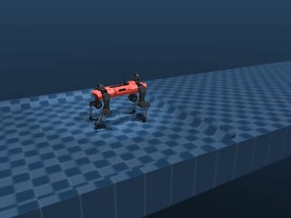

### Hypothesis 

Employing the PPO algorithm and transfer learning in the same configuration as the earlier experiment, we expect that the  model will be able to walk across the obstacle. 

### Experiment Setup 

Since we solely introduced a minor step (15 cm) in the environment by modifying the mujoco environment scen and replicated the prior experiment setup, the conditions remained unchanged from the previous experiment. The code was also modified to load the checkpoint files from the best network and optimizer to use the transfer learning technique.

#### Architecture 

The architecture remains the same as the previous experiment.

    self.mlp = nn.Sequential(
        nn.Linear(obs_len, 128),
        nn.Tanh(),
        nn.Linear(128, 128),
        nn.Tanh())

    self.actor = nn.Sequential(
        nn.Linear(128,64),
        nn.Tanh(),
        nn.Linear(64,act_len))

    self.critic = nn.Sequential(
        nn.Linear(128,64),
        nn.Tanh(),
        nn.Linear(64,1))

#### Hyperparameters 
    
We used the same hyperparameters that we obtained in the previous experiment.

    hparams = {
        'gamma' : 0.99,
        'log_interval' : 50,
        'num_episodes': 15000,
        'lr' : 1e-5,
        'clip_param': 0.1,
        'ppo_epoch': 48,
        'replay_size': 6400,
        'batch_size': 128,
        'c1': 1.,
        'c2': 0.001,
        'std_init': 1.0,
        'std_min': 0.6,
        }

### Results 

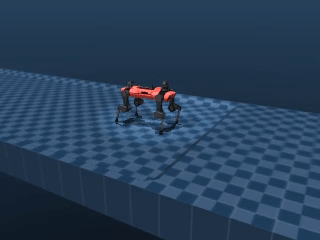

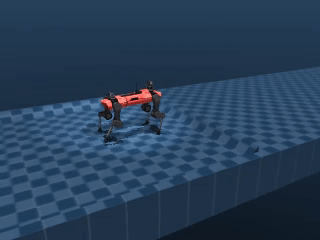

 
<h2> First model shoulder joint open-close movement for 50 episodes: mean = -0.06 , standard deviation = 0.18 </h2>
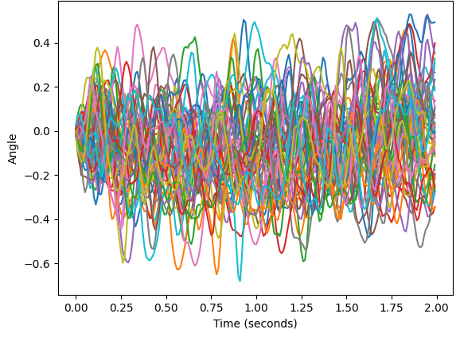

<h2> Sirst model shoulder joint open-close movement for 50 episodes: mean = -0.04 , standard deviation = 0.18 </h2>

<h2> First model shoulder joint rotate movement for 50 episodes: mean = -2.99 , standard deviation = 0.31 </h2>
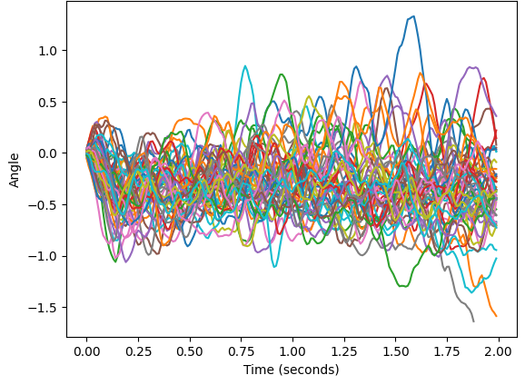

<h2> Second model shoulder joint rotate movement for 50 episodes: mean = -0.3 , standard deviation = 0.29 </h2>
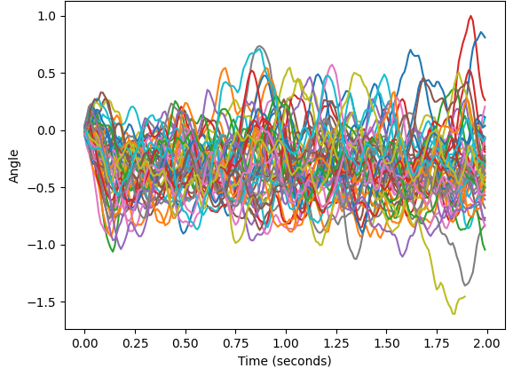

<h2> First model elbow joint rotate movement for 50 episodes: mean = -0.05 , standard deviation = 0.35 </h2>
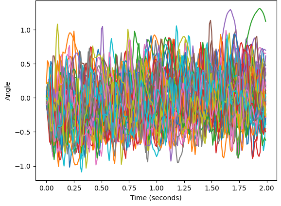

<h2> Second model elbow joint rotate movement for 50 episodes: mean = -0.06 , standard deviation = 0.35 </h2>
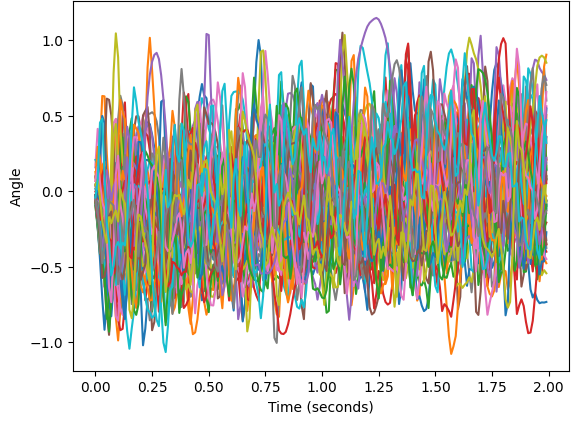

 
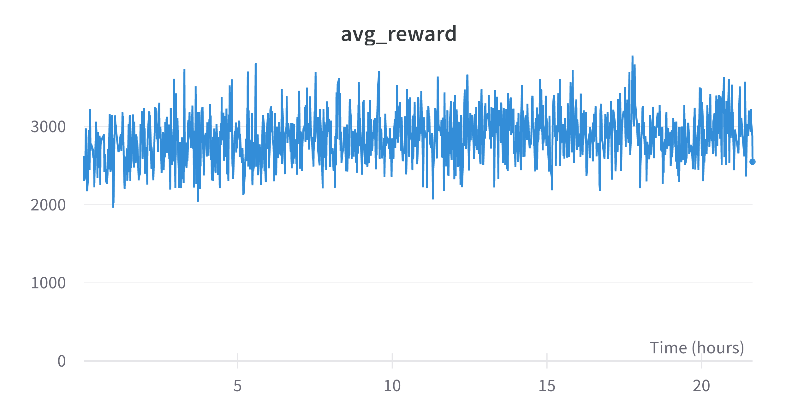
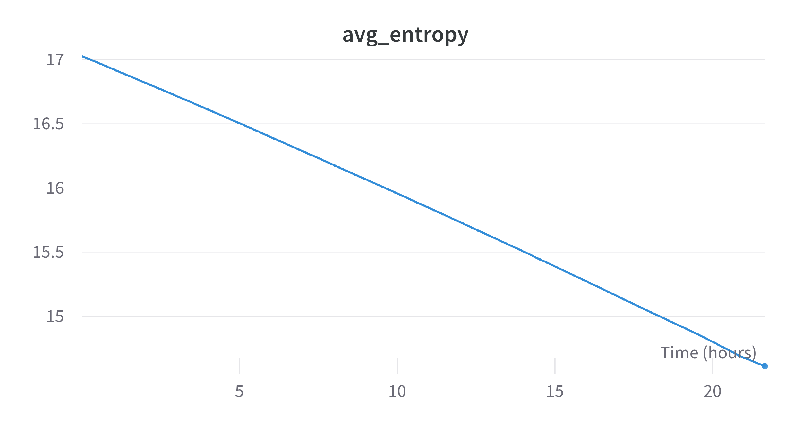

### Conclusions 

After analyzing the provided information, we arrived at the following conclusions:

1. The robot's average reward remained steady at approximately 3000. Additionally, with the aid of video animation, the robot was able to regain stability following any stumbling that occurred while crossing the obstacle. The range of the movements obtained by the 50 runs with this new model compared to the previous one is very similar. Therefore there is no evidence of a substantial change in the way the model walks but it has learnt to regain stability when it falls. Note that the previous model did not train in this case because the episodes ended when the robot height was under 30 cm.

2. The entropy showed a linear decrease from 17.925 to 14.611 over the course of 21.31 hours. This trend may indicate that the policy became more deterministic as the training progressed.

While the robot was able to successfully go over the step, it's performance fell below our expectations. However, we anticipate that making a sweep of hyperparameters may yield improved outcomes.

 

## Future Work 

    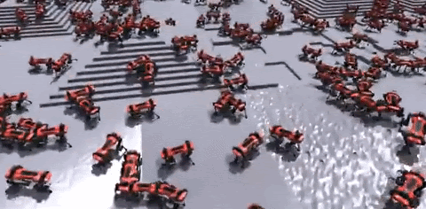

While we were able to achieve most of our initial goals, there are still some tasks that we were unable to finish. Moving forward, we have identified several interesting areas for future work, including: 

* Continue the hyperparameter tuning. 

* Training multiple actors and parallelizing with GPUs. 

* Expand the data included in the state representation (such as tracking the last actions taken, collisions, and terrain information). 

* Experiment with reward design by penalizing energy consumption to encourage smoother movements, 

* Explore non-linear changes to the entropy or using a neural network to determine the covariance matrix value. 

* Test the performance of the model with a larger neural network.

 

## Computational Resources 

As the neural networks that we used were pretty small, we didn't find ourselves in the need of using GPUs for the training of our models (we would have spent more time passing the parameters to the GPU than doing the actual calculations in the CPU). 

To add on that, MuJoCo runs only on CPU and has no GPU support currently, so the only use case for GPUs in our project has been the render and capture of the videos.

Given this situation, for the development of this project, we have mainly used Google Colab, and when we needed to do longer trainings, two laptops with better specs to speed up the process a little bit (and also don't get kicked out from the runtime).

Here are the specifications of the machines:

* Google Colab
    * Intel Xeon @ 2.20GHz
    * 12GB RAM
    * NVIDIA Tesla K80 12GB GDDR5

* Laptop #1
    * AMD Ryzen 7 5800H @ 3.20GHz
    * 16GB RAM
    * NVIDIA GeForce RTX 3070 8GB GDDR6

* Laptop #2
    * INTEL Core i7-9750H @ 2.60 GHz
    * 8GB RAM
    * NVIDIA GeForce GTX 1050 4GB GDDR5

 

## Glossary: Hyperparameters 

In the following list we explain the different hyperparameters:

1. gamma: discount factor for future rewards. A higher value indicates that future rewards are given more weight in the decision-making process.

2. log_interval: the number of training episodes between each logging statement. This determines how often to log information about the training progress, such as the reward or loss.

3. num_episodes: the total number of training episodes to run.

4. lr: the learning rate for the optimizer. This determines how much to update the model's weights based on the error of each prediction.

5. clip_param: the clipping parameter for the Proximal Policy Optimization (PPO) algorithm. This determines the maximum amount that the new policy can deviate from the old policy during each update.

6. ppo_epoch: the number of times to iterate over the entire training dataset during each PPO update. A higher value may improve convergence at the cost of increased computation.

7. replay_size: the maximum size of the replay buffer, which stores past observations and actions. A larger replay buffer can help stabilize training by preventing the model from overfitting to recent experiences.

8. batch_size: the number of samples to use for each mini-batch during training.

9. c1: the coefficient for the value loss term in the PPO loss function. A higher value indicates that the value loss term is given more weight in the overall loss.

10. c2: the coefficient for the entropy term in the PPO loss function. A higher value indicates that the entropy term is given more weight in the overall loss.

11. std_init: the initial standard deviation for the Gaussian policy.

12. std_min: the minimum standard deviation for the Gaussian policy. This determines the minimum value the action_std value can use, this is to prevent entropy levels that stop the training completely. 

## References 

[MuJoCo Documentation](https://mujoco.readthedocs.io/en/latest/overview.html)

[Gym Documentation](https://www.gymlibrary.dev/)

[Policy Gradient Methods slides by JuanJo Nieto](https://docs.google.com/presentation/d/1-wcaVYIKfTJepkRDBPjrEJ61d1f5QGYFolDzlRL6nKQ/edit#slide=id.g1b677ef8c8c_0_0)

[*Reinforcement Learning: An Introduction,* Richard S. Sutton & Andrew G. Barto](http://incompleteideas.net/book/the-book-2nd.html)

[PPO-PyTorch Github by nikhilbarhate99](https://github.com/nikhilbarhate99/PPO-PyTorch)

[Policy Gradient Algorithms by Lilian Weng](https://lilianweng.github.io/posts/2018-04-08-policy-gradient/)

[Learning to Walk in Minutes Using Massively Parallel Deep Reinforcement Learning](https://proceedings.mlr.press/v164/rudin22a/rudin22a.pdf)
